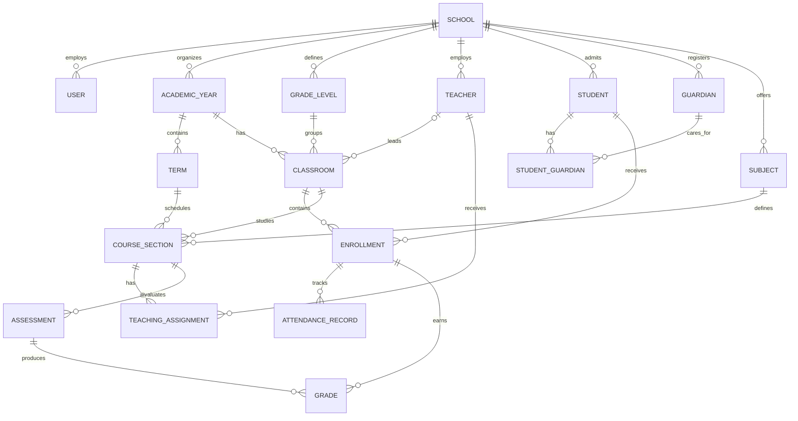

# Architecture and schema

## Frontend choice: Hotwire + Tailwind

Use Rails-rendered ERB views with Turbo, Stimulus, and Tailwind CSS.

This is the best default for this monolith because school administration is mostly forms, tables, filtering, approvals, attendance entry, and reports. Turbo makes navigation and small page updates feel fast; Stimulus handles focused browser behavior such as dependent selects and attendance grids; Tailwind provides a consistent responsive design without introducing a second application architecture.

A separate React/Vue SPA would require an API contract, duplicated validation and authorization concerns, client-side state management, and a second build/deployment pipeline. It can be added later for a genuinely isolated, interaction-heavy area, but it should not be the default.

## Entity relationship diagram

## Why it is structured this way

- `School` is the ownership boundary. Nearly all master data belongs to a school, preparing the app for safe multi-school operation.
- `AcademicYear` and `Term` preserve calendar history. A current-year boolean is convenience, not a replacement for dated records.
- `GradeLevel` means a reusable level such as Grade 5; `Classroom` means a specific group in one academic year, such as Grade 5A in 2026/27.
- `Enrollment` joins a student to a classroom for a period. Attendance and grades belong to enrollment, so transfers and promotions do not rewrite history.
- `Guardian` is independent from `Student`; the join supports siblings, multiple guardians, relationship labels, pickup authorization, and primary-contact selection.
- `Subject` is the catalog entry. `CourseSection` is that subject taught to one classroom in one term. This supports different teachers by term.
- `Assessment` stores the scoring definition; `Grade` stores one enrolled student's result. The unique index prevents duplicate results.
- `User` represents authenticated staff access, while `Teacher` represents the employee profile. This prevents login concerns from polluting academic records.

## Recommended module boundaries

Keep one Rails deployment and one MySQL cluster, but organize later code by domain: Identity, Academics, People, Attendance, Assessment, Billing, and Communication. These boundaries make the monolith easier to maintain and leave a clean extraction path only if scale eventually demands it.
